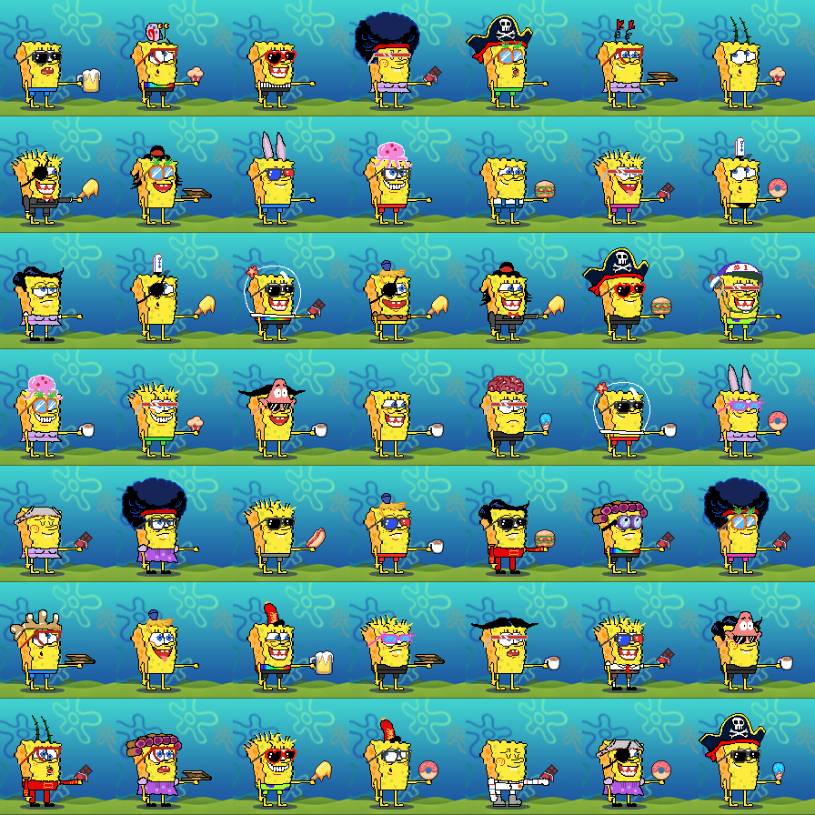

# NFT Art Generator

Script that generates unique images from a collection of component attribute based on weight.

 

### Dependencies

- python3.7
- numpy
- opencv-python


## Usage
Component folder structure, the order of layers will be used for final image compositing.

layers/  
├─ 01_layer/  
│  ├─ file1.png  
│  ├─ file2.png  
│  ├─ file3.png  
│  ├─ ...  
├─ 02_layer/  
│  ├─ file4.png  
│  ├─ file5.png  
│  ├─ ...  
├─ 03_layer/  
│  ├─ file6.png  
│  ├─ ...  
├─ ...  

Specify arguments at generator.py top
```python
layers_folder = 'example\layers'
layers_map_path = 'example\\'
attribute_map_path = 'example\\'
total_art = 500
image_output_path = 'example\\outputs\\'
```


```python
# create a layers map in layers_map_path.
create_json()

# user need to edit layers_map.json in layers_map_path to put in the weight on each attribute.
# generate attributes for all the art, save as json file in attribute_map_path.
generate_att()

# generate image based on the  attribute_map.json
generate_art()
```


```python
#multiprocessing for generate_art()
from itertools import islice
from multiprocessing import Process
if __name__ == '__main__':
    with open(project_folder + 'attributes_map.json', 'r') as f:
        attribute_map = json.load(f, object_pairs_hook=OrderedDict)
    def chunks(data, SIZE=100):
       it = iter(data)
       for i in range(0, len(data), SIZE):
          yield {k:data[k] for k in islice(it, SIZE)}
    for item in chunks(attribute_map):
        proc = Process(target=generate_art, args=(item,))
        proc.start()
```